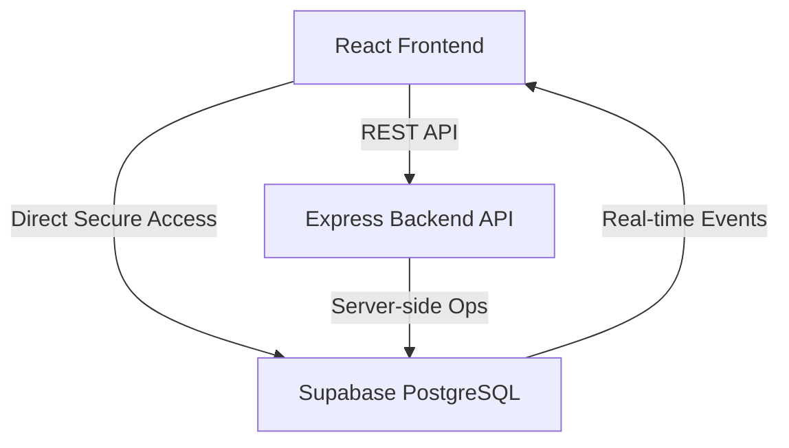
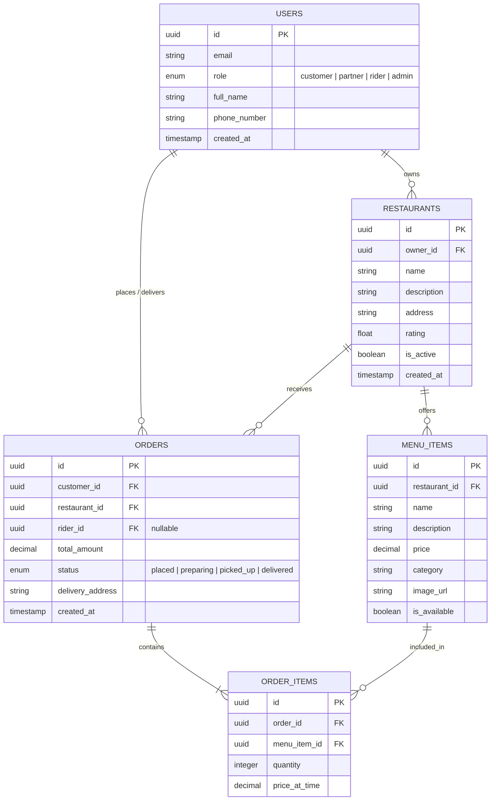

# FoodExpress 🚀

FoodExpress is a modern, full-stack food delivery web application that brings the golden age of Indian gastronomy to your doorstep. Designed with high-end glassmorphic aesthetics, fluid animations, and real-time logistics.


## 🛠 Tech Stack

**Frontend Architecture**
- **Framework**: React 18
- **Build Tool**: Vite
- **Language**: TypeScript
- **Routing**: React Router DOM
- **Styling**: Vanilla CSS (Modular, Glassmorphism design)
- **Icons**: Font Awesome 6.4 & Lucide React
- **Fonts**: Google Fonts (Outfit, Plus Jakarta Sans)

**Backend Architecture**
- **Runtime**: Node.js
- **Framework**: Express.js
- **Environment Management**: dotenv
- **Middleware**: CORS, Express JSON parser

**Database & Auth**
- **Platform**: Supabase
- **Database Engine**: PostgreSQL
- **Client Library**: `@supabase/supabase-js`

---

## 🏗 System Architecture

The application operates on a decoupled architecture, leveraging Supabase as the core Database as a Service (DBaaS). 



1. **Frontend**: Handles UI state, routing, and directly hooks into Supabase for Authentication and Real-time subscriptions (e.g., live delivery tracking).
2. **Backend**: Handles secure operations such as payment processing, complex aggregations, and admin-level overrides using the Supabase Service Role Key.
3. **Database**: Supabase (Postgres) stores all relational data and handles Row Level Security (RLS).

---

## 🗄 Relational Database Schema (PostgreSQL)

Below is the Entity-Relationship (ER) mapping designed for the Supabase PostgreSQL database.



### Table Definitions

1. **`users`**
   - Central identity table tied to Supabase Auth. Includes roles for Role-Based Access Control (RBAC).
   - Roles: `customer` (places orders), `partner` (restaurant owner), `rider` (delivery agent), `admin` (system overseer).

2. **`restaurants`**
   - Guilds/Kitchens available on the platform. Tied to a specific `user` with the `partner` role.

3. **`menu_items`**
   - Inventory catalogue for each restaurant. Controlled directly via the Restaurant Partner Dashboard.

4. **`orders`**
   - Tracks the entire lifecycle of a delivery. Uses enum states (`placed`, `preparing`, `picked_up`, `delivered`) for real-time tracking streams.

5. **`order_items`**
   - A junction table mapping individual menu items to their respective orders. Saves `price_at_time` to freeze prices in history if the menu item price changes later.

---

## 🚀 Getting Started

### 1. Clone the repository
```bash
git clone https://github.com/amankm2707-oss/foodexpress.git
cd foodexpress
```

### 2. Configure Environment Variables
You will need a Supabase account. Create a new project, copy your URL and Anon/Service keys, and create the following `.env` files:

**Frontend** (`frontend/.env`):
```env
VITE_SUPABASE_URL=your_supabase_url
VITE_SUPABASE_ANON_KEY=your_supabase_anon_key
```

**Backend** (`backend/.env`):
```env
PORT=5000
SUPABASE_URL=your_supabase_url
SUPABASE_SERVICE_ROLE_KEY=your_supabase_service_role_key
```

### 3. Run the Backend
```bash
cd backend
npm install
npm start
# Server will run on http://localhost:5000
```

### 4. Run the Frontend
```bash
cd frontend
npm install
npm run dev
# Vite will start the React app on http://localhost:5173
```

---

## 🎨 Design Highlights
- **Aurora Backgrounds**: Animated gradient blobs mimicking the aurora borealis.
- **Glassmorphism**: Translucent panels with background blurs simulating frosted glass.
- **Micro-interactions**: Magnetic buttons, custom liquid cursors, and 3D tilt effects on cards.
- **Bento Grids**: Modern, asymmetric grid layouts to display complex information concisely.
